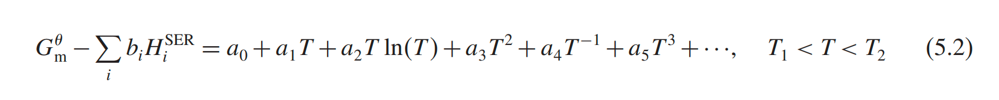
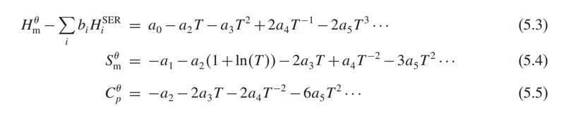

Let's start with the sublattice model.

I think there is a good way to learn sublattice model. As the knowledge I learnt, the *.TDB file stored the functions
to calculate Gibbs energy with sublattice model. When we open a .TDB file, we can directly see these functions. So,
here is the 'Al-Mg_Zhong.TDB'.

We can learn one function by one function.

The first one:
##############################################################################################################

     FUNCTION GHSERAL    298.15  -7976.15+137.071542*T-24.3671976*T*LN(T)
         -.001884662*T**2-8.77664E-07*T**3+74092*T**(-1);  		700  Y
          -11276.24+223.02695*T-38.5844296*T*LN(T)+.018531982*T**2
         -5.764227E-06*T**3+74092*T**(-1);  			933.6 Y
          -11277.683+188.661987*T-31.748192*T*LN(T)-1.234264E+28*T**(-9);
                                        2900 N !

###############################################################################################################

now the question is, what is GHSERAL?
From the spell, GH refers to Gibbs free energy, SER means standard element reference, and reference state is
usually the most stable form of the element at 1 bar and 298.15K. AL refers to element Al.

The whole GHSERAL refers to the Gibbs energy function of the element Al in its reference state.

When I try to understand what GHSERAL refers to, I found I missed some important information, here is that:

                ELEMENT AL   FCC_A1                    2.6982E+01  4.5773E+03  2.8322E+01!

That means the most stable form of pure Al at 1 bar and room temperature is FCC_A1, which indicates that GHSERAL is the
function of Gibbs energy of FCC_A1 for pure Al.

This equation is a polynomial fitting used to describe the temperature dependence of the Gibbs free energy of a phase.
The parameters gotten by the regression of experiment data. The physical significance of each term I asked chatGPT
directly:

            a0 represents the Gibbs free energy at absolute zero (or another reference state).
            a1T reflects the heat capacity contribution to the free energy.
            a2Tln(T) is related to the temperature dependence of the entropy.
            a4T-1 could be included to model specific temperature inversions, like electronic or magnetic contributions
            at low temperatures.
            ...

As my personal understanding, the numerical significance of this function is more important. 

Actually, the enthalpy and entropy can be obtained by this function with basic thermodynamics theory.

So look back at the FUNCTION GHSERAL, it is a regression result of its experiment data. It matches the temperature
dependence part in the book. 700 Y means the second function should be used above 700K, which means the first function
should be used below 700K. The 933.6 Y means the third function should be used when temperature is above 933.6K, and 
indicate that the second function should be used below 933.6K. 2900 N means the end of equation and the highest 
temperature for the third function is 2900K.

### Convert FUNCTION GHSERAL into function in python by pycalphad
The implement method of pycalphad can be seen when debug 'database-learning.py'. Set breakpoint at 6 row, and check the
process step by step.

The Database class in pycalphad allows three different database input, make the def \_new_ necessary. When I suppose
only .tdb file will be used as input, I made a \_init_ definition in __re-implement\function_of_database.py__. While I
did not change other code, the database can load normally. 

