## Temperature dependence

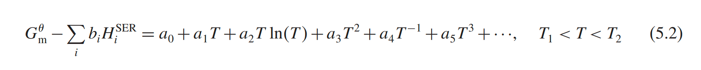

This equation is a polynomial fitting used to describe the temperature dependence of the Gibbs free energy of a phase.
The parameters gotten by the regression of experiment data. The physical significance of each term I asked chatGPT
directly:

            a0 represents the Gibbs free energy at absolute zero (or another reference state).
            a1T reflects the heat capacity contribution to the free energy.
            a2Tln(T) is related to the temperature dependence of the entropy.
            a4T-1 could be included to model specific temperature inversions, like electronic or magnetic contributions
            at low temperatures.
            ...

As my personal understanding, the numerical significance of this function is more important. 

Actually, the enthalpy and entropy can be obtained by this function with basic thermodynamics theory.

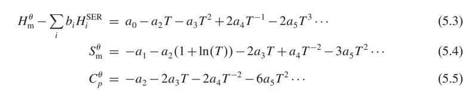

Each function can be used just in limited temperature range and above the Debye temperature. (When temperature is above
Debye temperature, the Cv will be a constant and equal to 3R. Enthalpy, as the integral of heat capacity, will 
continue to increase linearly with temperature. The entropy increases linearly with the logarithm of temperature.)

The lower temperature limit is usually 298.15K, which is sufficient because the require diffusion is necessary to reach
the equilibrium.

When temperature range is large, the regression will need more T^n (n=4, 5, 6...). To decrease the number of
coefficients, several temperature ranges and expressions should be used. Usually at least two and often up to four or 
five temperature regions with different coefficients are used to describe Gibbs energy. The first order and the second 
order derivatives of each function must be continuous, otherwise it will behave like a phase transition.

The io in pycalphad accomplishes read of database and makes it ready for Gibbs energy calculation with different 
conditions. While investigating how io module works, I continued the theory learning. The follow part is theory of 
pressure dependence.

## Pressure-dependence

For condensed matters, the pressure-dependent properties are often ignored, since they are only important at very high
temperature. For condensed phases under limited pressure range, Murnaghan model is useful.

The compressibility, the inverse of bulk modulus that assumed can be expressed by a linear pressure dependence. 

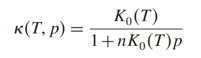

K0(T) is the compressibility at 0 pressure, and n is a constant that independent with temperature and pressure. n is 
about 4 for many phases.

The expression of thermal expansivity:

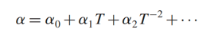

Integrate Murnaghan model with Gibbs energy:

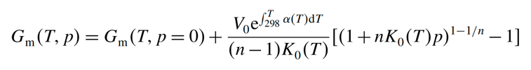

There is a new pressure-dependence model introduced, I did not describe it in details here.

## Metastable states
Gibbs energy sometimes also necessary when a compound is out of its stability temperature range. So the experimental 
data is not always enough, while this measurement may be inaccessible.

Two method: 1. extrapolations. 2. ab initio calculations.

It is necessary to estimate a value of the relative stability of the metastable structure as an “end member” of the
phase.

For extrapolations, the Kopp–Neumann rule is important.
It indicates that Cp(AmBn)=m×Cp(A)+n×Cp(B), as a result, H(AmBn)=m×H(A)+n×H(B). In the book, this equation is provided:

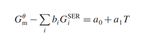

For my personal understanding, the Kopp–Neumann rule refers to the enthalpy terms in Gibbs energy, and the a0 and a1T...
represent the entropy term that need to fit the experiment result (As you can see in "how to get Gibbs energy from 
experiments" part, the use of Kopp–Neumann rule satisfy the condition of enthalpy, the mixture entropy(I am not very
sure) has no relationship like S(AmBn)=m×S(A)+n×S(B), so a0 and a1T term are required). 

Here is an example:
A has 3 different phase types, B has 3 different phase types. AmBn has 3 different phase types. when use the 
equation to calculate the Gibbs energy of three different phase types of AmBn. The GiSER all use the most stable phase 
for A and B at SER conditions.

There will be three functions for three phase types of AmBn like this:

        Gphase1=sum(bB\*GaSER+bB\*GbSER)+a0(phase1)+a1(phase1)T
        Gphase2=sum(bB\*GaSER+bB\*GbSER)+a0(phase2)+a1(phase2)T
        Gphase3=sum(bB\*GaSER+bB\*GbSER)+a0(phase3)+a1(phase3)T

### Notes: how to get Gibbs energy from experiments
Gibbs energy function: 

        ΔG = ΔH - TΔS

ΔH can be got calorimetrically. Under constant pressure, ΔH = Q. When Cp is independent from T, Q = (T2-T1)*Cp. So 
Cp = dQ/dT.

Then ΔS = ∫dQ/T, dQ = Cp*dT, so the ΔS = ∫(Cp/T)dT. For numerical approach, ΔS = Cp\*Ln(T2/T1)

## Variables for composition dependence
In each phase in the system the components may form many different species or ions and enter as constituents various
types of sites in a crystalline phase.

Concepts of composition, component, and constituent (may not precise):

            composition: 组成 Fe25Ni25Cr25Mn25
            component: 成分 Fe25 in Fe25Ni25Cr25Mn25
            constituent: 组分 (Fe5Ni5Cr5Mn5) and (Fe20Ni20Cr20Mn20) are two constituents. 

## Internal degree of freedom
Gibbs phase rule:

            F = C - P + 2

At an equilibrium, each phase has a same chemical potential, so for n phases there will be n-1 chemical potential 
equations, each term is a function of C and Pressure and Temperature. For m Components can provide m-1 independent
constraint equations. so the m-1 + 2 - (n-1) refers to the redundant equations, which is the freedom of the system.

## The constituent fraction
The species that constitute the phase are called the "constituents". For a gas, the constituents fraction is yi, of each
species i in the gas describes the internal equilibrium in the gas.

Crystalline phase, sublattices are constituents. And the fraction of sublattice is called "__site fraction__".

For a component:

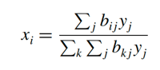

Denominator is the sum mole of the system. Numerator is the sum mole of component i.

It should notice:
If there are more constituents than components one cannot obtain the constituent fractions from the mole fractions
without a minimization of the Gibbs energy of the phase.

When number of constituents is larger than components, the equations of components are unsolvable. During the Global
minimization process, it will find the constituents refers to minimum Gibbs energy of the system. I feel it would be
very complex.

The concepts of sublattice, constituent, and site fraction.
A crystal can be separated into several sublattices. For certain sublattice, it contains some sites. A certain 
constituent will occupy sites in the sublattice. The number of sites occupied by constituent i is Ni.

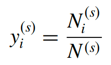  

Vacancy fraction:

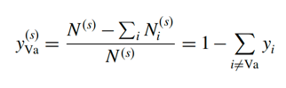

Vacancy can be treated as real component while its chemical potential is always zero.

### note: the detailed concepts of sublattice (important for calculate the derivatives of constituent)
I still feel confused by several concepts in sublattice. These concepts are important in some equations. So I want to
clarify these concepts.

    Lattice: The lattice refers to the highly ordered structure of a crystal. It is a three-dimensional arrangement of
             points (lattice points) that defines the positions of atoms or molecules in the crystal. Each point in the
             lattice represents the position of a particle and is periodically repeated in space.
    
    Sublattice: A sublattice is a division of the lattice where specific lattice points are occupied by a particular
                species or type of atom. In complex crystals, multiple sublattices can be present, each with a distinct
                arrangement or occupancy by different atomic or ionic species.
    
    Sites: These are the specific locations within the lattice or sublattice that can be occupied by atoms or ions.  
           Each site has a coordination number which tells how many neighboring atoms or ions directly surround a site.
    
    Species: In thermodynamic terms, species refer to the different types of particles (atoms, molecules, ions) that 
             are present in a system. In a lattice or sublattice, different species may occupy different sites.

    Constituents: The atoms, ions, or vacancies that occupy the sites within a sublattice. A single sublattice 
                  can have multiple different constituents (like Fe, Ni in one sublattice of an alloy), and their 
                  fractions add up to unity. For a certain constituent, it may contain two or more different kinds of 
                  elements.

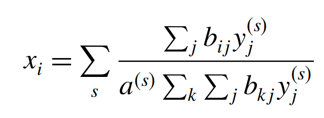 

The comparison of these two equations is a good way to understand the concepts of sublattice.

The difference between the equations is that the appearance of s. In the first equation, except first sum term, it is 
the calculation of xi in each sublattice. And yj(s) is each site fraction in that sublattice. For example, one phase 
may contain two sublattice, and each sublattice contains two different constituents. So yj(s) refers to the number of 
sites in constituent(j) divide number of sites in sublattice s. As a result, if without a(s) the equation depicts the
xi in a certain sublattice s. When each sublattice has different number of sites, to calculate the xi, it is necessary 
to multiply how much the sublattice s in the whole phase. So a(s) is needed.

For the second equation, the yj directly represent how much the site(j) of a constituent occupies in the whole phase 
crystal. The first equation makes each sublattice independent. 

For both equations, bij represent stoichiometric coefficient of element i in constituent j. This coefficient tells us 
how many atoms of element i are present in a given constituent j.

## Modeling particular physical phenomena

### Lattice vibrations
This method has still not been implemented in most software and will not be discussed further in the book.

### A ferromagnetic transition model

        First-order transition: The first order derivatives of Gibbs energy is not continuous. (The change of
                                compositions)
        Second-order transition: The second order derivatives of Gibbs energy is not continuous. (due to magnetic
                                 ordering or other internal changes, no composition changes)

Start with its contribution to the heat capacity of the system. Empirical expressions have been proposed by 
Inden (1981):

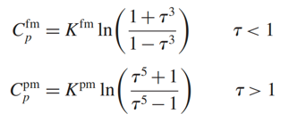

fm below Curie temperature, pm above Curie temperature. τ is T/Tc, Tc is Curie temperature. total magnetic contribution 
to the molar entropy is set equal to −Rln(1+β), where β is the mean magnetic moment measured in Bohr magnetons. This is 
equivalent to assuming that the magnetic entropy is due to the disordering of localized spins with average magnitude 
equal to β. I did not provide further details of magnetic transition, but the total Gibbs energy becomes this when 
considering magnetic transition:

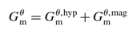

## Models for the Gibbs energy of solutions

###  The general form of the Gibbs-energy model

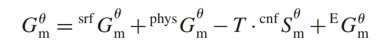

srf is "surface reference", represents _unreacted_ mixture of the constituents of the phase. I think the "unreacted" 
here means that it represents several constituents only are put on their positions, instead of any react, but only 
weighted sum of Gibbs energy of each constituent.

phy is Gibbs energy due to physical models.

cnf is "configurational entropy". It is based on the number of possible arrangements of constituents in the phase given
by S = kln(W).

E means excess Gibbs energy.

### The compound-energy formalism

The concept of "constituent array" specifies one or more constituents on each sublattice and is denoted I, while the 
individual constituents are denoted i, sometimes with a superscript (s) to denote the sublattice s.

To understand this concept, let's move step by step. 
        
        1. When the crystal type is defined, its sublattice model is defined too. That means, the number of sublattices
        and their fractions remain unchanging.
        
        2. When a sublattice only contains one constituent, the corresponding constituent array is a zeroth order array.
        While it contains more than one constituent, the array will be with different orders.

        3. The second point indicates that, if a sublattice only contains one constituent, the composition of the 
        sublattice is defined. When a sublattice contains more than one constituent, its composition is undefined.
        I think this will influence the process of global minimization.

The Gibbs-energy expression for the CEF is

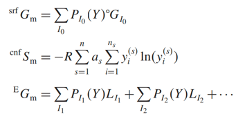

The first equation represent the sum Gibbs energy of sublattice with one constituent. In this case, PI0(Y) is always
equal to 1 since the sublattice is defined by one constituent. It is worth to notice that I0 maybe not any stable 
compound, so GI0 must be estimated in some way.

The second term calculated configurational entropy. When a sublattice s contains only one constituent, its 
configurational entropy is equal to zero. This equation only works when a sublattice contains more than one constituent.

The third equation represent the Gibbs energy of sublattics that contain more than one constituent.  For the second-
order constituent array it is necessary to include both the case with three interacting constituents on one sublattice 
and that with two interacting constituents on two different sublattices. _My personal understanding of "include both the
case with three interacting constituents on one sublattice and that with two interacting constituents on two different 
sublattices" is when a sublattice contains three constituents, we cannot suppose that this sublattice will contain all 
three constituents. We need to consider if it just contains two constituents. In this case, two independent group of two
constituents need to be considered separately._ This phenomenon is called "reciprocal interactions".

For partial Gibbs energy equation:

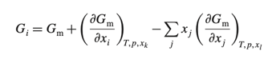

When using sublattice model, it might not be possible to directly calculate the partial Gibbs energy of a component, but
the partial Gibbs energy for a constituent array of zeroth order can be calculated by:

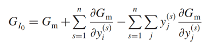

where the first sum is taken over the constituents i defined by the constituent array (one in each sublattice) and the 
second sum is over all constituents in all sublattices. The first sum term indicates that a zeroth-order constituent 
array can be associated with multiple sublattices.

