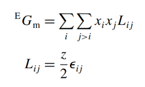
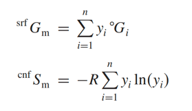
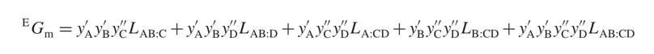

## Temperature dependence

This equation is a polynomial fitting used to describe the temperature dependence of the Gibbs free energy of a phase.
The parameters gotten by the regression of experiment data. The physical significance of each term I asked chatGPT
directly:

            a0 represents the Gibbs free energy at absolute zero (or another reference state).
            a1T reflects the heat capacity contribution to the free energy.
            a2Tln(T) is related to the temperature dependence of the entropy.
            a4T-1 could be included to model specific temperature inversions, like electronic or magnetic contributions
            at low temperatures.
            ...

As my personal understanding, the numerical significance of this function is more important. 

Actually, the enthalpy and entropy can be obtained by this function with basic thermodynamics theory.

Each function can be used just in limited temperature range and above the Debye temperature. (When temperature is above
Debye temperature, the Cv will be a constant and equal to 3R. Enthalpy, as the integral of heat capacity, will 
continue to increase linearly with temperature. The entropy increases linearly with the logarithm of temperature.)

The lower temperature limit is usually 298.15K, which is sufficient because the require diffusion is necessary to reach
the equilibrium.

When temperature range is large, the regression will need more T^n (n=4, 5, 6...). To decrease the number of
coefficients, several temperature ranges and expressions should be used. Usually at least two and often up to four or 
five temperature regions with different coefficients are used to describe Gibbs energy. The first order and the second 
order derivatives of each function must be continuous, otherwise it will behave like a phase transition.

The io in pycalphad accomplishes read of database and makes it ready for Gibbs energy calculation with different 
conditions. While investigating how io module works, I continued the theory learning. The follow part is theory of 
pressure dependence.

## Pressure-dependence

For condensed matters, the pressure-dependent properties are often ignored, since they are only important at very high
temperature. For condensed phases under limited pressure range, Murnaghan model is useful.

The compressibility, the inverse of bulk modulus that assumed can be expressed by a linear pressure dependence. 

K0(T) is the compressibility at 0 pressure, and n is a constant that independent with temperature and pressure. n is 
about 4 for many phases.

The expression of thermal expansivity:

Integrate Murnaghan model with Gibbs energy:

There is a new pressure-dependence model introduced, I did not describe it in details here.

## Metastable states
Gibbs energy sometimes also necessary when a compound is out of its stability temperature range. So the experimental 
data is not always enough, while this measurement may be inaccessible.

Two method: 1. extrapolations. 2. ab initio calculations.

It is necessary to estimate a value of the relative stability of the metastable structure as an “end member” of the
phase.

For extrapolations, the Kopp–Neumann rule is important.
It indicates that Cp(AmBn)=m×Cp(A)+n×Cp(B), as a result, H(AmBn)=m×H(A)+n×H(B). In the book, this equation is provided:

For my personal understanding, the Kopp–Neumann rule refers to the enthalpy terms in Gibbs energy, and the a0 and a1T...
represent the entropy term that need to fit the experiment result (As you can see in "how to get Gibbs energy from 
experiments" part, the use of Kopp–Neumann rule satisfy the condition of enthalpy, the mixture entropy(I am not very
sure) has no relationship like S(AmBn)=m×S(A)+n×S(B), so a0 and a1T term are required). 

Here is an example:
A has 3 different phase types, B has 3 different phase types. AmBn has 3 different phase types. when use the 
equation to calculate the Gibbs energy of three different phase types of AmBn. The GiSER all use the most stable phase 
for A and B at SER conditions.

There will be three functions for three phase types of AmBn like this:

        Gphase1=sum(bB\*GaSER+bB\*GbSER)+a0(phase1)+a1(phase1)T
        Gphase2=sum(bB\*GaSER+bB\*GbSER)+a0(phase2)+a1(phase2)T
        Gphase3=sum(bB\*GaSER+bB\*GbSER)+a0(phase3)+a1(phase3)T

### Notes: how to get Gibbs energy from experiments
Gibbs energy function: 

        ΔG = ΔH - TΔS

ΔH can be got calorimetrically. Under constant pressure, ΔH = Q. When Cp is independent from T, Q = (T2-T1)*Cp. So 
Cp = dQ/dT.

Then ΔS = ∫dQ/T, dQ = Cp*dT, so the ΔS = ∫(Cp/T)dT. For numerical approach, ΔS = Cp\*Ln(T2/T1)

## Variables for composition dependence
In each phase in the system the components may form many different species or ions and enter as constituents various
types of sites in a crystalline phase.

Concepts of composition, component, and constituent (may not precise):

            composition: 组成 Fe25Ni25Cr25Mn25
            component: 成分 Fe25 in Fe25Ni25Cr25Mn25
            constituent: 组分 (Fe5Ni5Cr5Mn5) and (Fe20Ni20Cr20Mn20) are two constituents. 

## Internal degree of freedom
Gibbs phase rule:

            F = C - P + 2

At an equilibrium, each phase has a same chemical potential, so for n phases there will be n-1 chemical potential 
equations, each term is a function of C and Pressure and Temperature. For m Components can provide m-1 independent
constraint equations. so the m-1 + 2 - (n-1) refers to the redundant equations, which is the freedom of the system.

## The constituent fraction
The species that constitute the phase are called the "constituents". For a gas, the constituents fraction is yi, of each
species i in the gas describes the internal equilibrium in the gas.

Crystalline phase, sublattices are constituents. And the fraction of sublattice is called "__site fraction__".

For a component:

Denominator is the sum mole of the system. Numerator is the sum mole of component i.

It should notice:
If there are more constituents than components one cannot obtain the constituent fractions from the mole fractions
without a minimization of the Gibbs energy of the phase.

When number of constituents is larger than components, the equations of components are unsolvable. During the Global
minimization process, it will find the constituents refers to minimum Gibbs energy of the system. I feel it would be
very complex.

The concepts of sublattice, constituent, and site fraction.
A crystal can be separated into several sublattices. For certain sublattice, it contains some sites. A certain 
constituent will occupy sites in the sublattice. The number of sites occupied by constituent i is Ni.

  

Vacancy fraction:

Vacancy can be treated as real component while its chemical potential is always zero.

### note: the detailed concepts of sublattice (important for calculate the derivatives of constituent)
I still feel confused by several concepts in sublattice. These concepts are important in some equations. So I want to
clarify these concepts.

    Lattice: The lattice refers to the highly ordered structure of a crystal. It is a three-dimensional arrangement of
             points (lattice points) that defines the positions of atoms or molecules in the crystal. Each point in the
             lattice represents the position of a particle and is periodically repeated in space.
    
    Sublattice: A sublattice is a division of the lattice where specific lattice points are occupied by a particular
                species or type of atom. In complex crystals, multiple sublattices can be present, each with a distinct
                arrangement or occupancy by different atomic or ionic species.
    
    Sites: These are the specific locations within the lattice or sublattice that can be occupied by atoms or ions.  
           Each site has a coordination number which tells how many neighboring atoms or ions directly surround a site.
    
    Species: In thermodynamic terms, species refer to the different types of particles (atoms, molecules, ions) that 
             are present in a system. In a lattice or sublattice, different species may occupy different sites.

    Constituents: The atoms, ions, or vacancies that occupy the sites within a sublattice. A single sublattice 
                  can have multiple different constituents (like Fe, Ni in one sublattice of an alloy), and their 
                  fractions add up to unity. For a certain constituent, it may contain two or more different kinds of 
                  elements.

 

The comparison of these two equations is a good way to understand the concepts of sublattice.

The difference between the equations is that the appearance of s. In the first equation, except first sum term, it is 
the calculation of xi in each sublattice. And yj(s) is each site fraction in that sublattice. For example, one phase 
may contain two sublattice, and each sublattice contains two different constituents. So yj(s) refers to the number of 
sites in constituent(j) divide number of sites in sublattice s. As a result, if without a(s) the equation depicts the
xi in a certain sublattice s. When each sublattice has different number of sites, to calculate the xi, it is necessary 
to multiply how much the sublattice s in the whole phase. So a(s) is needed.

For the second equation, the yj directly represent how much the site(j) of a constituent occupies in the whole phase 
crystal. The first equation makes each sublattice independent. 

For both equations, bij represent stoichiometric coefficient of element i in constituent j. This coefficient tells us 
how many atoms of element i are present in a given constituent j.

## Modeling particular physical phenomena

### Lattice vibrations
This method has still not been implemented in most software and will not be discussed further in the book.

### A ferromagnetic transition model

        First-order transition: The first order derivatives of Gibbs energy is not continuous. (The change of
                                compositions)
        Second-order transition: The second order derivatives of Gibbs energy is not continuous. (due to magnetic
                                 ordering or other internal changes, no composition changes)

Start with its contribution to the heat capacity of the system. Empirical expressions have been proposed by 
Inden (1981):

fm below Curie temperature, pm above Curie temperature. τ is T/Tc, Tc is Curie temperature. total magnetic contribution 
to the molar entropy is set equal to −Rln(1+β), where β is the mean magnetic moment measured in Bohr magnetons. This is 
equivalent to assuming that the magnetic entropy is due to the disordering of localized spins with average magnitude 
equal to β. I did not provide further details of magnetic transition, but the total Gibbs energy becomes this when 
considering magnetic transition:

## Models for the Gibbs energy of solutions

###  The general form of the Gibbs-energy model

srf is "surface reference", represents _unreacted_ mixture of the constituents of the phase. I think the "unreacted" 
here means that it represents several constituents only are put on their positions, instead of any react, but only 
weighted sum of Gibbs energy of each constituent.

phy is Gibbs energy due to physical models.

cnf is "configurational entropy". It is based on the number of possible arrangements of constituents in the phase given
by S = kln(W).

E means excess Gibbs energy.

### The compound-energy formalism

The concept of "constituent array" specifies one or more constituents on each sublattice and is denoted I, while the 
individual constituents are denoted i, sometimes with a superscript (s) to denote the sublattice s.

To understand this concept, let's move step by step. 
        
        1. When the crystal type is defined, its sublattice model is defined too. That means, the number of sublattices
        and their fractions remain unchanging.
        
        2. When a sublattice only contains one constituent, the corresponding constituent array is a zeroth order array.
        While it contains more than one constituent, the array will be with different orders.

        3. The second point indicates that, if a sublattice only contains one constituent, the composition of the 
        sublattice is defined. When a sublattice contains more than one constituent, its composition is undefined.
        I think this will influence the process of global minimization.

The Gibbs-energy expression for the CEF is

The first equation represent the sum Gibbs energy of sublattice with one constituent. In this case, PI0(Y) is always
equal to 1 since the sublattice is defined by one constituent. It is worth to notice that I0 maybe not any stable 
compound, so GI0 must be estimated in some way.

The second term calculated configurational entropy. When a sublattice s contains only one constituent, its 
configurational entropy is equal to zero. This equation only works when a sublattice contains more than one constituent.

The third equation represent the Gibbs energy of sublattics that contain more than one constituent.  For the second-
order constituent array it is necessary to include both the case with three interacting constituents on one sublattice 
and that with two interacting constituents on two different sublattices. _My personal understanding of "include both the
case with three interacting constituents on one sublattice and that with two interacting constituents on two different 
sublattices" is when a sublattice contains three constituents, we cannot suppose that this sublattice will contain all 
three constituents. We need to consider if it just contains two constituents. In this case, two independent group of two
constituents need to be considered separately._ This phenomenon is called "reciprocal interactions".

For partial Gibbs energy equation:

When using sublattice model, it might not be possible to directly calculate the partial Gibbs energy of a component, but
the partial Gibbs energy for a constituent array of zeroth order can be calculated by:

where the first sum is taken over the constituents i defined by the constituent array (one in each sublattice) and the 
second sum is over all constituents in all sublattices. The first sum term indicates that a zeroth-order constituent 
array can be associated with multiple sublattices.

### The relation between the compound and cluster energies

It seems to be a Gibbs energy modeling method, I did not read it in details.

### The reference state for the Gibbs energy

This part provide Gibbs energy modeling method for a constituent array I.

bij is the stoichiometry factor for the component j in the constituent array I and HjSER is the enthalpy of the 
component j in its reference state.

### The ideal-substitutional-solution model

When a solution of non-interacting constituents mixing randomly with each other, the Gibbs energy is:

The condition is, the constituents are the same as components.

When the constituents are different from components, the Gibbs energy is

that the mixing of constituents on each sublattice is an ideal solution.

For gas phase:

General form of gibbs energy of ideal-substitutional-solution:

It is important to select a good “ideal” model in order to have a simple excess Gibbs energy.

When surroundings of a constituent are irrelevant can be described by ideal models. 

## Non-ideal behavior of solutions

In an ideal solution, the bond between two different constituents is equal to that between two identical constituents.
The simplest way to introduce a non-ideal behavior of solutions is to introduce the energy difference for these 
different bonds as:

It is the difference between the i—j bond energy and the average of the i—i and j—j bond energies. When ε is negative,
 it means that unlike constituents prefer to be together, i.e., long- and short-range order or clustering. If ε is
positive, the constituents prefer to surround themselves with constituents of the same kind, which leads to the
formation of miscibility gap.

In crystalline solid the number of bonds is fixed, but liquid phase the number of bonds can vary.

### The substitutional-regular-solution model

### Dilute solutions, Henry’s and Raoult’s laws

In the very dilute range all phases have the property that the activity of each of the constituents varies linearly with
the fraction of the constituent.

Raoult’s law applies to the solvent in a dilute solution, stating that the activity of the solvent is equal to the 
fraction of the solvent when the solute is dilute. Indicating ai=xi.

Hillert’s method to describe the gibbs energy for a solute in solvent:

Mj is a modification of 0Gj when "1" is the solvent. The first sum term means the combine of j with other solutes minus 
their combination with solvent respectively.

## Models for the excess Gibbs energy

Equations for the excess Gibbs energy:

The binary, ternary, and higher-order interactions in the excess Gibbs energy will be described separately.

### The binary excess contribution to multicomponent systems

Equation:

Sum over interactions of i and j. For a sublattice model, the xi,xj are the components fractions in the constituent, 
which means xi+xj not must be equal to 1. It can describe excess gibbs energy in each sublattice of a phase and the
constituent fractions should be used.

Physical point of view, if the nearest neighbor atoms number is z, the Lij=(z/2)εij. If Lij (regular-solution parameter)
is independent of temperature, the model is called strictly regular model. In a real system, the regular-solution 
parameters in different phases should be modeled with the same order of magnitude. Because the bond energies is 
approximately independent of the phase structure.

## The Redlich-Kister binary model

The equation:

R-K model is an extension of a single interaction parameter in a binary system, since a single interaction is always not
enough to describe the experimental data. v here is different order of the interaction between i and j. This model is 
advantageous for multi-component system, because the difference betweem i and j makes the excess energy remains the same
shape with it in binary system. Only magnitude will change when the summation of xi and xj change.

When observe this figure, do not forget the excess gibbs energy need to multiply the xi*xj. At least two orders need to 
be considered since 0L is symmetrical.

"subregular-solution model" is sometimes used when just two RK coefficients are employed, and “subsubregular” indicates 
using three.

If using many coefficients for R-K model, the description may not be proper when extrapolate to multi-component system.

Parameter vLij is temperature dependent.  a linear temperature dependence is enough and only when heat-capacity data are
available may one use more:

excess enthalpy is described by aij and the excess entropy by bij. The Redlich–Kister power series is useful only when 
the excess enthalpy is a smooth function.

### The ternary excess contributions

Hillert suggested the following type of composition dependence in the ternary excess parameter:

### Higher-order excess contributions

More summations, if there are discrepancies, correct by reassessment of the lower-order systems.

### Extrapolation methods for binary excess models

Muggianu method is a preferable method. Its treatment is only related to the relative value of two component and their 
volume in the system. The idea is like R-K method. 

a ternary parameter that can be evaluated from the binary excess parameters. 

1LAC and 1LBC is subregular-solution parameters. As depicted in R-K model, the zero order term, the (xi-xj)^0 will 
always be 1, so it is composition independent. The first order term is (xi-xj)^1, which means the linearly dependent 
relationship of Gibbs energy and composition. The physical significance is that the equation mainly focus on the 
interaction of each component.

## Modeling using additional constituents

I have browsed this part before learning the details. The former part is the modeling by "end member". No formation of 
"strong" compounds involved since it has relatively "strange" behavior of gibbs energy, which will disturb the modeling
process by regular-solution model.

There is a strong ordering in Mg2Sn. Two obvious features are the low entropy of mixing and the sharp increase of the 
activity. It cannot be treated by the excess-Gibbs-energy formalism which describes a smooth change in curvature over 
the whole composition range. It will introduce too many coefficients to describe this behavior. It is preferable to 
modify the srfGm and cnfSm terms. For solid phases, sublattices can be introduced. For liquids and for cases in which
sublattices are not possible, one may introduce fictitious constituents, usually called associates（联合体）.

Fictitious constituents are used to describe short-range order (SRO), i.e., the local arrangement of atoms, and the 
sublattice model to describe long-range order (LRO).

In systems with SRO, unlike atoms tend to stay together for a shorter or longer length of time. The term “associate” was
introduced to denote an association between unlike atoms when the attractive forces between the atoms are not strong 
enough to form a stable chemical molecule.

In the book the example of H–O system is used. H2O is directly considered as a constituent and thus there is no excess 
gibbs energy.

Substitutional associated solution equations:

### Non-random configurational entropy

If the interactions create short-range ordering, its contribution to the Gibbs energy must be considered differently.

####  The quasi-chemical model

Equation:

mass-balance constraints:

If yAB = yBA there is no LRO. When yAB=yBA, the bond between A and B has no preference. In this situation, the term
RTyABln2 should be added since the positions of A and B are random. When oGAB = 0, it would be the ideal solution. The 
z/2 indicates that each bond is distinct, so when oGAB = 0 each bond is not distinct. In this case, the entropy is 
overestimated. It can be understood if z=2. When z=2, it identically represents the gas of AA, BB, AB, and BA. While the
gas molecule can rotate freely, the atoms in phase crystal need to stay in its site, to correct the overestimation:

#### The cluster-variation method

Introduces clusters with three, four or more atoms. fcc lattice in the tetrahedron approximation：

For the case in which there is no LRO, there are five constituents or “clusters,” A, A0.75B0.25, A0.5B0.5, A0.25B0.75, 
and B. Formulas:

The correction of id.cnfS is complex, it contains term of the free degree of each tetrahedron and pair probability.

## Modeling using sublattice

The simplest case of a sublattice model would be two sublattices with two constituents in each. A shorthand notation of
this would be (A, B)m(C, D)n. m and n give the ratio of sites on the two sublattices. __In a crystalline m and n are 
fixed numbers__. It is advisable to use the smallest possible integer numbers for the site ratios. The constituents A, 
B, C, and D can represent atoms, ions, anti-site atoms, vacancies, etc. It should notice that the quantities of A and B
in the sublattice are not necessarily fixed. This approach provides the flexibility for the composition of the compound.

### Reciprocal solutions

Cannot be modeled as substitutional solution

the reciprocal energy represented by this reaction is

First two terms in CEF:

In srfGm, there are A:C, B:D, A:D, and B:C. They indicate only constituents in different sublattices are considered 
interaction. Constituents in the same sublattice are not considered interaction. yi' and yj" are the constituent
fractions on sublattices 1 and 2. A colon is used to separate constituents on different sublattices in the parameter 
expression. Two constituents on the same sublattice will sometimes be separated by a comma. In this model, AD, AC, BD, 
and BC are end members.

Partial gibbs energy of end member AD:

#### Excess Gibbs energy for the reciprocal solution

Equation:

There are two “binary” interaction parameters for each sublattice depending on the constituent on the other sublattice 
and these are related to the four sides of the constitutional square. The physical significance is the "binary" interaction 
under the influence of constituents on the other sublattice.

expanded RK formula:

For the models with more sublattices, the excess Gibbs energy is expanded in the same way as for the reciprocal system.

#### The reciprocal miscibility gap

When the reciprocal Gibbs energy, Delta G in Eq. (5.92), is sufficiently large this will create a phase separation with 
the tie-lines parallel to the diagonal and with the largest energy difference between the corner compounds. The large 
Delta G means that there is a tendency to form AC and BD rather than AD and BC. To make a clear understanding, I suppose
several parameters and calculated and visualized miscibility gap in "miscibility gap in reciprocal solution.py" file 
code direction. AC_BD_end_member_G is set at -10000 and AD_BC_end_member_G is set at -5000. Where the delta G is -10000,
which means AC and BD is more likely to form. It is obvious with the figure below.

When there are no data for an end member of a reciprocal solution, it is often useful to estimate using the assumption 
that the Delta G in is zero. To avoid the presence of a reciprocal miscibility gap, Hillert suggested the use of a
special reciprocal parameter:

the result when add hillert excess gibbs energy:

### Models using two sublattices

When there are several constituents in each sublattice, one can write the model: (A,B...)m(U,V...)n. When no same 
constituent in different sublattice, the Gibbs energy is:

#### Interstitial solutions

The main characteristic of an interstitial solution is that one of the constituents is the vacancy. A model for B1 as
both metal and carbon–nitride–boride phases in a multicomponent steel is (Fe,Cr,Ni,Ti...)1(Va,C,N,B...)1.

#### Models for phases involving metals and non-metals

More than one crystallographically different sublattice for the metallic element, not enough experimental data.
(Cr,Fe...)20(Cr,Fe,Mo,W...)3(C)6 is an example that some of the elements do not enter all sublattices.

#### The Wagner–Schottky defect model

The first thing needs to be noticed here is that the "defect" is compared to the compounds with perfect compositions. 
For real situation, the composition will have little variations.

AaBb is a perfect compound, the defects model will be (A,X)a(B,Y)b. This model can be described in the CEF as a
reciprocal model with four end members: AB, AY, XB, and XY. The defects can be

    (1) anti-site atoms, i.e., B atoms on the sublattice for A and A atoms on the sublattice
    for B;
    (2) vacancies;
    (3) interstitials; or
    (4) a mixture of the above defects

If interstitial defects are important, the model can be (A)a(B)b(Va,A,B)c. bcc with two identical sublattices, one often
has anti-site atoms on one side of the ideal composition and vacancies on the other. model is (A,B)1(B,Va)1. In (A,B)1, 
B is anti-sites atom. Because two sublattices are crystallographically identical, so the compound can be equally written
BA as AB. For this reason one must include all defects on both sublattices; allowing both anti-site atoms and vacancies
the model should be (A,B,Va)1(B,A,Va)1. 

The Wagner–Schottky defect model considers only one defect for each sublattice and three parameters are needed:

GX:Y is considered not stable, thus it is set equal to zero.

GA:A is gibbs energy of pure A with the structure of AaBb, GB:B is the same thing. GB:A is gibbs energy of pure defects.

using these two equation, we can derive:

when defects tend to be zero, we can derive:

