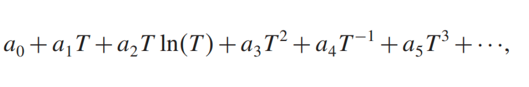
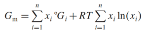
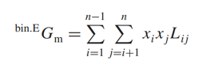
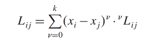
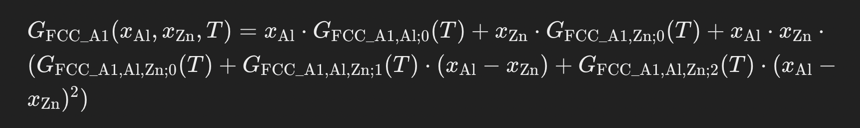

## The reading of .TDB files

### The reading of alzn_mey.tdb

alzn_mey.tdb file is a relatively simple .tdb file along with various thermodynamics databases. It just used the 
constituent model without sublattice model.

    $ ALMG
    $
    $ TDB-file for the thermodynamic assessment of the Al-Mg system
    $
    $--------------------------------------------------------------------------
    $ 2008.10.15
    $ 
    $ TDB file for PANDAT/TC created by M.Palumbo, T.Abe and K.Hashimoto
    $
    $ Particle Simulation and Thermodynamics Group, National Institute for 
    $ Materials Science. 1-2-1 Sengen, Tsukuba, Ibaraki 305-0047, Japan
    $ e-mail: abe.taichi@nims.go.jp
    $ Copyright (C) NIMS 2008
    $
    $
    $ PARAMETERS ARE TAKEN FROM 
    $   Y. Zhong, M. Yang, Z.-K. Liu CALPHAD 29 (2005) pp. 303-311
    $
    $ -------------------------------------------------------------------------
    $

The lines begin with '$' symbol means this line is a description or some data that is not willing to involve in the 
model.

All .tdb files (as far as I see) describes the system at the beginning:

     ELEMENT /-   ELECTRON_GAS              0.0000E+00  0.0000E+00  0.0000E+00!
     ELEMENT VA   VACUUM                    0.0000E+00  0.0000E+00  0.0000E+00!
     ELEMENT AL   FCC_A1                    2.6982E+01  4.5773E+03  2.8322E+01!
     ELEMENT MG   HCP_A3                    2.4305E+01  4.9980E+03  3.2671E+01!

what does each column refers to can be got by _TDB_PROCESSOR in pycalphad.
This line in _TDB_PROCESSOR is used to process ELEMENT in .tbd file:

    'ELEMENT': lambda db, el, ref_phase, mass, h, s: (db.elements.add(el), _process_reference_state(db, el, ref_phase, mass, h, s), _process_species(db, el, [el, 1], 0))

so the el refers to /-, VA, AL, and MG. ref_phase refers to the element at reference state. The first row of numbers is
the mass (relative atomic mass or relative molecule mass). The second row of numbers is enthalpy. The third row is 
entropy.

    FUNCTION  GHSERAL  298.0
        -7976.15+137.0715*T-24.36720*T*LN(T)-1.884662E-3*T**2-0.877664E-6*T**3
        +74092*T**(-1);                                                   700.00 Y
        -11276.24+223.0269*T-38.58443*T*LN(T)+18.531982E-3*T**2-5.764227E-6*T**3
        +74092*T**(-1);                                                    933.6 Y
        -11277.68+188.6620*T-31.74819*T*LN(T)-1234.26E25*T**(-9);        2900.00 N ! 
     FUNCTION  GALLIQ   298.0
        +3029.403+125.2307*T-24.36720*T*LN(T)-1.884662E-3*T**2-0.877664E-6*T**3
        +74092*T**(-1)+79.401E-21*T**7;                                   700.00 Y
        -270.6860+211.1861*T-38.58443*T*LN(T)+18.53198E-3*T**2-5.764227E-6*T**3
        +74092*T**(-1)+79.401E-21*T**7;                                    933.6 Y
        -795.7090+177.4100*T-31.74819*T*LN(T);                           2900.00 N !
     FUNCTION  GALHCP   298.0  +5481-1.8*T+GHSERAL#;                      6000  N !
    
    
     FUNCTION GHSERZN    298.0  -7285.787+118.4693*T-23.70131*T*LN(T)
         -.001712034*T**2-1.264963E-06*T**3;                              692.7 Y
         -11070.60+172.3449*T-31.38*T*LN(T)+4.70657E+26*T**(-9);           1700 N !
     $FUNCTION GZNLIQ     298.0  -1.285170+108.1769*T-23.70131*T*LN(T)
     $    -.001712034*T**2-1.264963E-06*T**3-3.585652E-19*T**7;            692.7 Y
     $    -11070.60+172.3449*T-31.38*T*LN(T)+4.70657E+26*T**(-9);           1700 N !
     FUNCTION GZNLIQ     298.14  +7157.213-10.29299*T-3.5896E-19*T**7+GHSERZN#;
                                                                          692.7 Y
         +7450.168-10.737066*T-4.7051E+26*T**(-9)+GHSERZN#;                 1700 N !
     FUNCTION GZNFCC     298.15  +2969.82-1.56968*T+GHSERZN#;               1700 N !

The first part is the gibbs energy functions for pure elements. GHSER represent the phase when the element at reference
state. 

The GHSER and gibbs energy of liquid phase for each element is fit experimental results with above equaiton.

     TYPE_DEFINITION % SEQ *!
     DEFINE_SYSTEM_DEFAULT ELEMENT 2 !
     DEFAULT_COMMAND DEF_SYS_ELEMENT VA /- !

some default information, last two rows do nothing in pycalphad as in _TDB_PROCESSOR their value is unimplemented.

     PHASE LIQUID %  1  1.0  !
     CONSTITUENT LIQUID :AL,ZN :  !
       PARAMETER G(LIQUID,AL;0)      298.15  +GALLIQ#;                      2900 N !
       PARAMETER G(LIQUID,ZN;0)      298.15  +GZNLIQ#;                      1700 N !
       PARAMETER G(LIQUID,AL,ZN;0)   298.15  +10465.5-3.39259*T;            6000 N !

PHASE LIQUID %  1  1.0  ! means below represents the gibbs energy of LIQUID phase. 1 means it is a 1 sublattice (no 
sublattice involves). 1.0 means the number of sites occupied by each sublattice. In this case, it can be ignored.
The gibbs energy of LIQUID phase can be calculated with:

and add the excess energy term:

and the interaction parameter can be used by RK model:

in this case, the excess energy term 'PARAMETER G(LIQUID,AL,ZN;0)' only contains zero-order term that is independent 
with composition.

    $-------------------------------------------------------------------------------
    $ FUNCTIONS FOR FCC_A1
    $-------------------------------------------------------------------------------
     PHASE FCC_A1  %  1  1.0  !
     CONSTITUENT FCC_A1  :AL,ZN :  !
       PARAMETER G(FCC_A1,AL;0)      298.15  +GHSERAL#;                     2900 N !
       PARAMETER G(FCC_A1,ZN;0)      298.15  +GZNFCC#;                      1700 N !
       PARAMETER G(FCC_A1,AL,ZN;0)   298.15  +7297.5+0.47512*T;             6000 N !
       PARAMETER G(FCC_A1,AL,ZN;1)   298.15  +6612.9-4.5911*T;              6000 N !
       PARAMETER G(FCC_A1,AL,ZN;2)   298.15  -3097.2+3.30635*T;             6000 N !

in FCC_A1 case, the excess energy term has three orders interaction parameters, and the gibbs energy is:

     PHASE HCP_A3  %  1  1.0  !
     CONSTITUENT HCP_A3  :AL,ZN :  !
      PARAMETER G(HCP_A3,AL;0)       298.15  +GALHCP#;                      2900 N !
      PARAMETER G(HCP_A3,ZN;0)       298.15  +GHSERZN#;                     1700 N !
      PARAMETER G(HCP_A3,AL,ZN;0)    298.15  +18821.0-8.95255*T;            6000 N !
      PARAMETER G(HCP_A3,AL,ZN;3)    298.15  -702.8;                        6000 N !

HCP phase is just the same.

