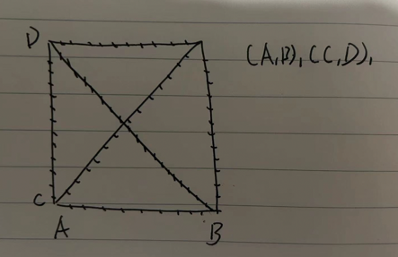
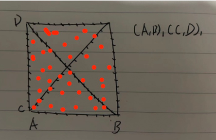

## Introduction

When I learn the book 'Computational Thermodynamics: The Calphad Method', I found there is no detailed explanation of
the global minimization algorithm. I want to learn how this achieved by reading the code of pycalphad.

### io module

The function of io module is to convert the .tdb file to equations and conditions executable by codes. I'd like to skip
this part.

### calculation part

I am curious how pycalphad done the calculations while it is really complex to me, I want to start part by part. I think
I can begin with calculate.py file or equilibrium file.

#### Building of model and phase_records

models is the .tdb file after converted into symbolic manipulation expressions. It can be used for calculation 
derivatives with the symbols. It fits the requirement of thermodynamics calculations very well. The process method is
mainly integrated in io part. 

    #pylint: disable=C0103
    # These are standard abbreviations from Thermo-Calc for these quantities
    energy = GM = property(lambda self: self.ast)
    formulaenergy = G = property(lambda self: self.ast * self._site_ratio_normalization)
    entropy = SM = property(lambda self: -self.GM.diff(v.T))
    enthalpy = HM = property(lambda self: self.GM - v.T*self.GM.diff(v.T))
    heat_capacity = CPM = property(lambda self: -v.T*self.GM.diff(v.T, v.T))
    #pylint: enable=C0103
    mixing_energy = GM_MIX = property(lambda self: self.GM - self.endmember_reference_model.GM)
    mixing_enthalpy = HM_MIX = property(lambda self: self.GM_MIX - v.T*self.GM_MIX.diff(v.T))
    mixing_entropy = SM_MIX = property(lambda self: -self.GM_MIX.diff(v.T))
    mixing_heat_capacity = CPM_MIX = property(lambda self: -v.T*self.GM_MIX.diff(v.T, v.T))

Above is the formulas default in model.

    if phase_records is None:
        models = instantiate_models(dbf, comps, active_phases, model=model, parameters=parameters)
        phase_records = build_phase_records(dbf, comps, active_phases, statevar_dict,
                                            models=models, parameters=parameters,
                                            output=output, callables=callables,
                                            build_gradients=False, build_hessians=False,
                                            verbose=kwargs.pop('verbose', False))

#### points generator

The points generated for the calculation is generated by function _sample_phase_constitution

    points = _sample_phase_constitution(mod, sampler_dict[phase_name] or point_sample,
                                                    fixedgrid_dict[phase_name], pdens_dict[phase_name])

step into _sample_phase_constitution

    points = np.concatenate(list(itertools.chain([points], extra_points)))

this code generate points along each endmember(in or not in the same sublattice), it works like this:

    points = np.concatenate((points, sampler(sublattice_dof, pdof=pdens)))

this code using monte-carlo method to generate random points, it works like red dots:

#### gibbs energy calculations for generated points

when using debug mode, _compute_phase_values is considered as an important function, after using of this function, the 
'GM' of a set of points can be obtained.

        phase_ds = _compute_phase_values(nonvacant_components, str_statevar_dict,
                                     points, phase_record, output,
                                     maximum_internal_dof, broadcast=broadcast, parameters=parameters,
                                     largest_energy=float(largest_energy), fake_points=fp)

in this function, the compositions and gibbs energy are calculated. The first step is organize state variables into the 
calculation array. The core codes are:

    # This can be considered as the combinations of state variables. It provides a list contains different variables and
    their value. When using [:-1] and sparse=True, [np.empty(points.shape[-2])] seems not work, the primary idea may 
    want to match the shape of points directly at first.

    statevars = np.meshgrid(*itertools.chain(statevar_dict.values(),
                                                     [np.empty(points.shape[-2])]),
                                    sparse=True, indexing='ij')[:-1]

    # 2D points convert to the shape that (number of first variable, number of second variable,..., shape of points). 
    This is used for the future flatten operation.

    points = broadcast_to(points, tuple(len(np.atleast_1d(x)) for x in statevar_dict.values()) + points.shape[-2:])
    
    # This makes state variables to the number of it needs to be calculated.

    bc_statevars = np.ascontiguousarray([broadcast_to(x, points.shape[:-1]).reshape(-1) for x in statevars])
        
    # Flatten the points array
    pts = points.reshape(-1, points.shape[-1])

    # concatenate the bc_statevars and flatten points.
    dof = np.ascontiguousarray(np.concatenate((bc_statevars.T, pts), axis=1))

This is the core code for gibbs energy calculation without parameters: phase_record.obj_2d(phase_output, dof).
obj_2d is written in cython. Let us read the phase_rec.pyx code.

Before dive into the phase_rec.pyx, we need to understand the callables part. Some functions are done with classes in 
phase_rec.pyx.

The main purpose of callables part is to convert symbolic expression into the function that can be directly used. It
includes the converting of Gm, the mass calculation(for each component), and G. After the converting, all the functions
is going to set into phase_rec.

The class PhaseRecord contains all built functions for thermodynamics calculations. And the calling of these functions
are integrated into this class. There is another class called FastFunction in phase_rec, the purpose of this class is to
convert the functions of symengine into c types to accelerate calculations.

This is class FastFunction.

    def __cinit__(self, object func):
            if func is None:
                self.f_ptr = NULL
                self.func_data = NULL
                return
            if isinstance(func, FastFunction):
                func = func._objref
            # Preserve reference to object to prevent garbage collection
            self._objref = func
            addr1, addr2 = func.as_ctypes()
            self.f_ptr = (<math_function_t*><size_t>ctypes.addressof(addr1))[0]
            self.func_data =  (<void**><size_t>ctypes.addressof(addr2))[0]
    def __reduce__(self):
        return FastFunction, (self._objref,)
    cdef void call(self, double *out, double *inp) nogil:
        if self.f_ptr != NULL:
            self.f_ptr(out, inp, self.func_data)

This may be related to low level symengine and c code? I can get the function of these codes, but I did not dive into 
the low level mechanism. 

    addr1, addr2 = func.as_ctypes()
    self.f_ptr = (<math_function_t*><size_t>ctypes.addressof(addr1))[0]
    self.func_data =  (<void**><size_t>ctypes.addressof(addr2))[0]

During the initialization of PhaseRecord class, the symengine functions are converted into FastFunction class. When 
calculating generated grid, several functions inside the PhaseRecord class are called according to conditions. These 
functions are similar, here is an example:

    @cython.boundscheck(False)
    @cython.wraparound(False)
    cpdef void obj_2d(self, double[::1] outp, double[:, ::1] dof) nogil:
        # dof.shape[1] may be oversized by the caller; do not trust it
        cdef double* dof_concat = alloc_dof_with_parameters_vectorized(dof[:, :self.num_statevars+self.phase_dof], self.parameters)

        cdef int i
        cdef int num_inps = dof.shape[0]
        cdef int num_dof = self.num_statevars + self.phase_dof + self.parameters.shape[0]
        for i in range(num_inps):
            self._obj.call(&outp[i], &dof_concat[i * num_dof])
        if self.parameters.shape[0] > 0:
            free(dof_concat)

double[::1] ::1 means the memory view of the one-dimensional array is contiguous, double[:, ::1] means it is a 
two-dimensional array, and the memory view for columns in each row are also contiguous.

This 'cdef double* dof_concat = alloc_dof_with_parameters_vectorized' change dof into the pointer of dof array, the 
purpose is to accelerate calculations.

self._obj.call(&outp[i], &dof_concat[i * num_dof]). This line input the address of outputs array and dof_concat, so the
outputs will be modified directly during the _obj.call. After this manipulation, phase_output will become the values of 
'GM'(default), and their compositions will be calculated by mass_obj and stored in phase_compositions.

#### calculate module results arrangement

The return value from calculate module is processed 'data_arrays', which is:

    data_arrays = {'X': (output_columns + ['component'], np.ascontiguousarray(phase_compositions)),
                       'Phase': (output_columns, phase_names),
                       'Y': (output_columns + ['internal_dof'], expanded_points),
                       output: (['dim_'+str(i) for i in range(len(phase_output.shape) - (len(output_columns)+len(parameter_column)))] + output_columns + parameter_column, phase_output)
                       }

They organized the structure of data_arrays really well, the first tuple of each key is related to the dimension of 
arrays and its variable. 'X' and 'Y' here are component compositions and dof compositions, maybe it used for finding 
start points? 'output' is just calculation outputs. Phase is the calculated phase.

After all energy of phases are calculated, they are arranged into a single LightDataset class to accelerate later
calculations.

This is the finish of calculate part, I feel the next part should be how to calculate a single equilibrium.

### equilibrium part

Use the example in Official documentation. The code is:

    from pycalphad import Database, calculate, equilibrium, variables as v
    
    dbf = Database('alzn_mey.tdb')
    comps = ['AL', 'ZN', 'VA']
    phases = ['LIQUID', 'FCC_A1', 'HCP_A3']
    eq_result = equilibrium(dbf, comps , phases, {v.X('ZN'):0.5, v.T: 500, v.P:101325}, output='GM', to_xarray=False)

so step into equilibrium, figure out what happened.

grid is calculated through calculated module, and I have addressed that previously. Then is to use grid to find the 
starting_point.

    properties = starting_point(conds, state_variables, phase_records, grid)

Inside starting_point, ds_vars is used to store data:

    ds_vars = {'NP':     (conds_as_strings + ['vertex'], np.empty(grid_shape + (len(nonvacant_elements)+1,))),
               'GM':     (conds_as_strings, np.empty(grid_shape)),
               'MU':     (conds_as_strings + ['component'], np.empty(grid_shape + (len(nonvacant_elements),))),
               'X':      (conds_as_strings + ['vertex', 'component'],
                          np.empty(grid_shape + (len(nonvacant_elements)+1, len(nonvacant_elements),))),
               'Y':      (conds_as_strings + ['vertex', 'internal_dof'],
                          np.empty(grid_shape + (len(nonvacant_elements)+1, maximum_internal_dof,))),
               'Phase':  (conds_as_strings + ['vertex'],
                          np.empty(grid_shape + (len(nonvacant_elements)+1,), dtype='U%s' % max_phase_name_len)),
               'points': (conds_as_strings + ['vertex'],
                          np.empty(grid_shape + (len(nonvacant_elements)+1,), dtype=np.int32))
               }

after built the ds_vars, ds_vars and coord_dict were combined into a LightDataset class, and is ready for input into
lower_convex_hull function.

    result = LightDataset(ds_vars, coords=coord_dict, attrs={'engine': 'pycalphad %s' % pycalphad_version})
    result = lower_convex_hull(grid, state_variables, result)

In lower_convex_hull function, the codes before function 'hyperplane' seem to be used for multi-task condition 
management. hyperplane function is written in .pyx, now we can step into it.

    properties = _solve_eq_at_conditions(properties, phase_records, grid,
                                         list(str_conds.keys()), state_variables,
                                         verbose, solver=solver)

